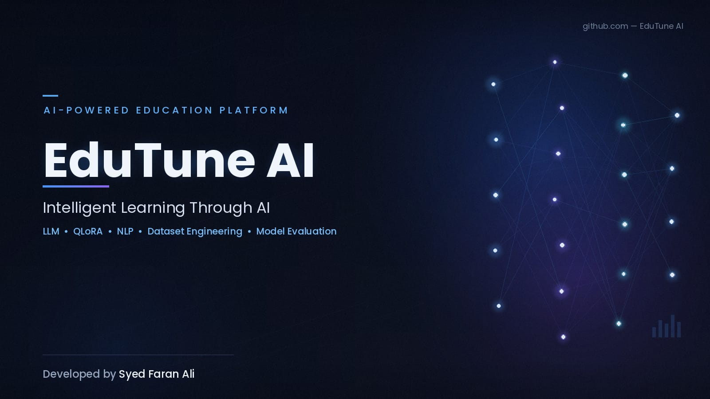
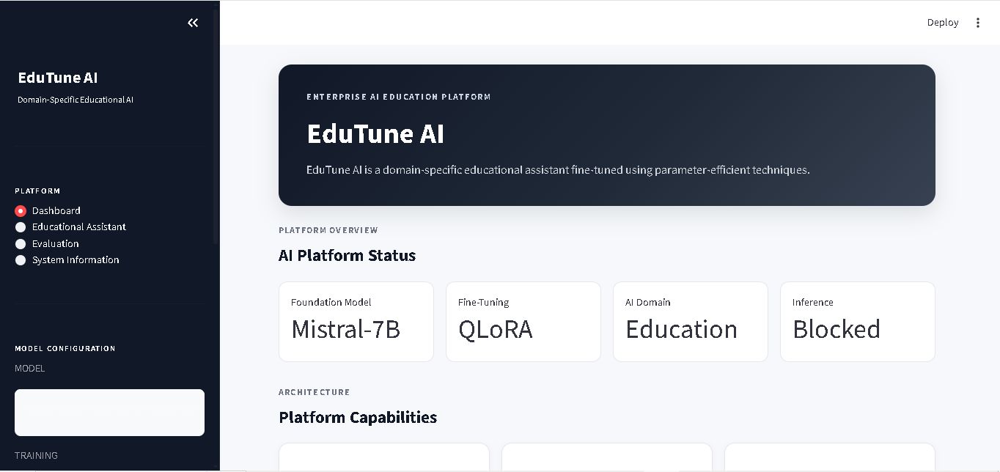
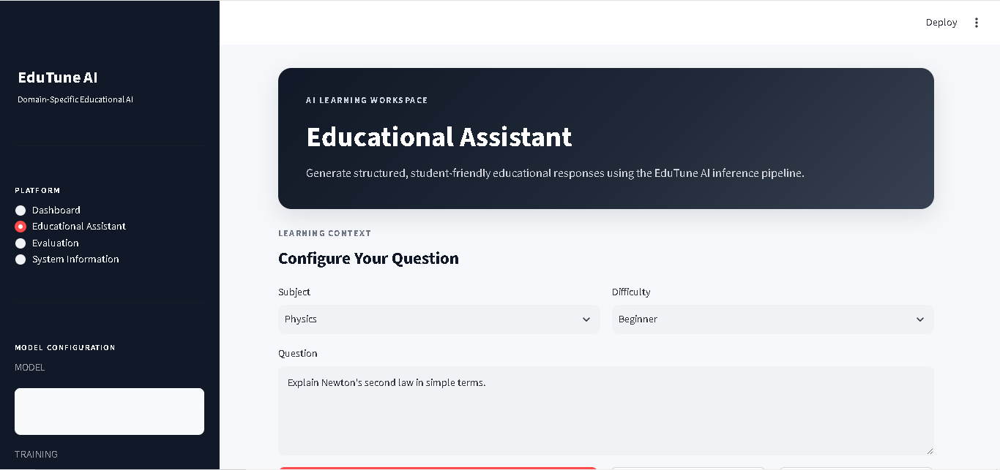
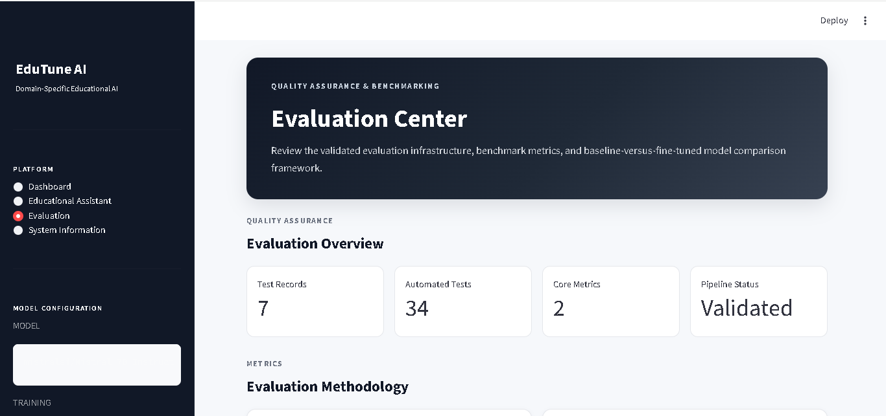
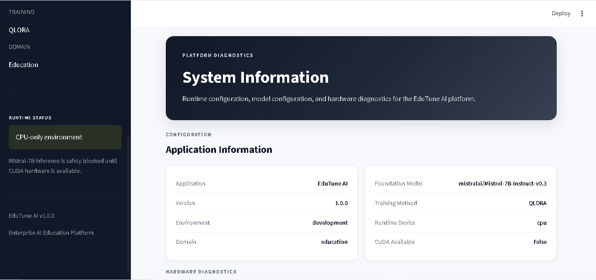

# EduTune AI

### Enterprise Educational AI Platform for Dataset Engineering, QLoRA Fine-Tuning, Inference & Evaluation



**EduTune AI** is an education-focused generative AI platform engineered around `mistralai/Mistral-7B-Instruct-v0.3`. The project demonstrates a complete, modular AI engineering workflow spanning educational dataset construction, curation, synthetic data generation, validation, hardware-aware model management, inference, evaluation, model comparison, and QLoRA-based fine-tuning preparation.

The application provides an enterprise-style Streamlit interface for educational assistance, evaluation workflows, and system diagnostics.

> **Current hardware note:** The development environment is CPU-only (`CUDA available: false`). The project therefore blocks Mistral-7B model loading and QLoRA training when CUDA is unavailable rather than attempting unsafe large-model operations. Software validation, dataset engineering, tokenizer operations, evaluation logic, and automated tests remain available.

---

## Project Highlights

| Capability | Implementation |
|---|---|
| Educational AI assistant | Streamlit + modular assistant layer |
| Foundation model | `mistralai/Mistral-7B-Instruct-v0.3` |
| Fine-tuning strategy | QLoRA / LoRA |
| Quantization | 4-bit NF4 configuration |
| Dataset engineering | Seed → curate → synthetic → validate |
| Dataset formats | JSONL |
| Inference | Educational and chat prompt pipelines |
| Evaluation | Exact Match + Token Overlap |
| Model comparison | Absolute + relative improvement |
| Hardware safety | CUDA-aware model/training guards |
| Application | Enterprise-style Streamlit dashboard |
| Testing | pytest |
| Experiment tracking | Weights & Biases integration |
| Configuration | Python + YAML + environment variables |

---

## Why EduTune AI?

General-purpose language models are not automatically optimized for educational interactions. EduTune AI provides a structured foundation for adapting a language model to education-oriented tasks while keeping data preparation, training configuration, inference, and evaluation independently testable.

The platform is designed around five engineering principles:

1. **Domain specialization** — educational prompts and datasets are first-class project artifacts.
2. **Modularity** — data, training, inference, evaluation, assistant, and utilities are separated into dedicated packages.
3. **Hardware awareness** — large-model operations are checked before loading or training.
4. **Reproducibility** — configuration, random seeds, evaluation artifacts, reports, and automated tests are maintained as project assets.
5. **Evaluation integrity** — stored prediction/reference metrics are explicitly distinguished from successful live model inference.

---

# Core Capabilities

## 1. Educational Assistant

The assistant layer provides structured educational interactions through:

- Educational question validation
- Subject-aware prompts
- Difficulty-aware educational assistance
- Optional learning context
- Chat history management
- Chat reset functionality
- Response extraction and formatting
- Safe response generation

Relevant modules:

```text
assistant/
├── chat.py
├── educational_tasks.py
└── response_formatter.py
```

---

## 2. Dataset Engineering

EduTune AI implements a multi-stage educational data pipeline:

```text
Seed Dataset
     │
     ▼
Dataset Curation
     │
     ▼
Synthetic Data Generation
     │
     ▼
Validation
     │
     ▼
Train / Validation / Test
     │
     ▼
Fine-Tuning / Evaluation
```

The pipeline supports:

- Seed dataset construction
- Record curation
- Instruction formatting
- Synthetic example generation
- Duplicate detection
- Repeated-phrase checks
- Schema validation
- Category analysis
- Difficulty analysis
- Task-type analysis
- Training dataset preparation

Relevant modules:

```text
data_pipeline/
├── build_dataset.py
├── curate_dataset.py
├── format_instruction.py
├── generate_synthetic.py
└── validate_dataset.py
```

---

## 3. Current Dataset Snapshot

The packaged project contains the following persisted educational data:

| Dataset | Records | Purpose |
|---|---:|---|
| Raw seed dataset | 8 | Initial educational examples |
| Curated dataset | 8 | Validated/curated seed data |
| Synthetic dataset | 64 | Expanded educational examples |
| Training split | 56 | Training-ready evaluation data |
| Validation split | 8 | Validation data |
| Test split | 8 | Test/evaluation data |

The validation artifact currently reports **zero parsing errors, record errors, duplicates, and repeated phrases** for both the curated and synthetic datasets.

### Subject coverage

The project currently represents:

- Biology
- Computer Science
- Economics
- Mathematics
- Physics

### Synthetic task coverage

The synthetic dataset includes:

- Concept explanation
- Example generation
- Question answering
- Study guidance

---

# Model & Fine-Tuning Architecture

## Base Model

```text
mistralai/Mistral-7B-Instruct-v0.3
```

The model is configured as the foundation model for EduTune AI.

## QLoRA Strategy

The training configuration uses:

```text
Quantized Base Model
        │
        ▼
4-bit NF4 Quantization
        │
        ▼
LoRA Adapter Layers
        │
        ▼
Supervised Fine-Tuning
        │
        ▼
EduTune AI Adapter
```

Configured LoRA parameters include:

```text
rank: 16
alpha: 32
dropout: 0.05
bias: none
```

Configured target modules include:

```text
q_proj
k_proj
v_proj
o_proj
gate_proj
up_proj
down_proj
```

The project is designed to save adapters separately from the base model:

```text
models/
├── adapters/
└── checkpoints/
```

---

# Hardware-Aware Design

Large language models require substantial compute and memory resources. EduTune AI therefore checks hardware availability before model-intensive operations.

The current development environment reports:

```text
Device: CPU
CUDA available: False
CUDA devices: 0
GPU: None
```

When CUDA is unavailable, the model-loading layer intentionally returns a blocked status:

```text
Model loading status: BLOCKED

CUDA is unavailable. Mistral-7B weights will not be loaded on this CPU-only machine.
```

This behavior is intentional.

It prevents the application from attempting to load the configured 7B model on unsupported hardware and provides a predictable failure mode.

### What still works on CPU

The CPU-only environment can still be used for:

- Dataset construction
- Dataset curation
- Synthetic dataset generation
- Dataset validation
- Tokenizer loading
- Prompt generation
- Evaluation utilities
- Model-comparison utilities
- Hardware diagnostics
- Application-level testing
- Automated test suite
- Notebook-based analysis
- Documentation and reporting

### Required environment for actual Mistral-7B training/inference

A compatible CUDA-enabled environment is required for the intended large-model workflow.

The exact hardware requirement depends on the selected quantization, memory configuration, batch size, sequence length, and training setup.

---

# Evaluation Framework

EduTune AI separates evaluation into reusable components.

```text
evaluation/
├── evaluator.py
├── metrics.py
├── baseline.py
├── benchmark.py
└── compare_models.py
```

## Metrics

### Exact Match

Determines whether normalized prediction and reference text are identical.

```text
1.00 = exact normalized match
0.00 = no exact match
```

### Token Overlap

Measures token-level overlap between prediction and reference text and provides a more flexible comparison than exact matching.

### Model Comparison

The comparison layer supports:

- Baseline metrics
- Fine-tuned metrics
- Absolute improvement
- Relative improvement percentage

The persisted comparison artifact currently contains:

| Metric | Baseline | Fine-Tuned | Absolute Improvement | Relative Improvement |
|---|---:|---:|---:|---:|
| Exact Match | 0.40 | 0.70 | 0.30 | 75.00% |
| Token Overlap | 0.60 | 0.80 | 0.20 | 33.33% |

**Evaluation integrity note:** these values are persisted project artifacts. They should be interpreted according to the accompanying evaluation reports and should not be presented as a live Mistral-7B GPU benchmark from the current CPU-only development machine.

---

# Application

EduTune AI includes an enterprise-style Streamlit application.

### Main application areas

- Dashboard
- Educational Assistant
- Evaluation
- System Information
- Runtime hardware diagnostics
- Model configuration visibility
- Training configuration visibility

### Application screenshots

#### Dashboard



#### Educational Assistant



#### Evaluation



#### System Information



---

# System Architecture

```text
                         ┌─────────────────────────────┐
                         │          EduTune AI         │
                         │    Educational AI Platform  │
                         └──────────────┬──────────────┘
                                        │
             ┌──────────────────────────┼──────────────────────────┐
             │                          │                          │
             ▼                          ▼                          ▼
     ┌───────────────┐          ┌───────────────┐          ┌───────────────┐
     │ Data Pipeline │          │ Model Pipeline│          │ Application   │
     └───────┬───────┘          └───────┬───────┘          └───────┬───────┘
             │                          │                          │
      ┌──────┼──────┐             ┌─────┼─────┐             ┌─────┼─────┐
      ▼      ▼      ▼             ▼           ▼             ▼     ▼     ▼
     Seed   Curate Synthetic     Tokenizer   QLoRA       Dashboard Assistant System
      │      │      │             │           │
      └──────┴──────┘             │           │
             │                    └─────┬─────┘
             ▼                          ▼
        Validation                 Mistral-7B
             │                          │
             ▼                          ▼
      Train / Val / Test          Inference Layer
                                        │
                                        ▼
                                  Hardware Safety
                                        │
                                 CUDA / GPU Check
                                        │
                                        ▼
                                  Evaluation Layer
                                        │
                          ┌─────────────┴─────────────┐
                          ▼                           ▼
                       Baseline                  Comparison
                          │                           │
                          └─────────────┬─────────────┘
                                        ▼
                                  Reports / Analysis
```

---

# Repository Structure

```text
edutune-ai/
│
├── app.py
├── README.md
├── LICENSE
├── requirements.txt
├── .env.example
├── .gitignore
│
├── assistant/
│   ├── chat.py
│   ├── educational_tasks.py
│   └── response_formatter.py
│
├── config/
│   ├── settings.py
│   └── training_config.yaml
│
├── data/
│   ├── raw/
│   │   └── education_seed.jsonl
│   ├── processed/
│   │   └── curated_dataset.jsonl
│   ├── synthetic/
│   │   └── synthetic_dataset.jsonl
│   └── evaluation/
│       ├── train.jsonl
│       ├── validation.jsonl
│       ├── test.jsonl
│       ├── baseline_model_report.json
│       ├── baseline_benchmark_report.json
│       ├── baseline_evaluation_report.json
│       ├── dataset_validation_report.json
│       └── model_comparison_report.json
│
├── data_pipeline/
│   ├── build_dataset.py
│   ├── curate_dataset.py
│   ├── format_instruction.py
│   ├── generate_synthetic.py
│   └── validate_dataset.py
│
├── evaluation/
│   ├── baseline.py
│   ├── benchmark.py
│   ├── compare_models.py
│   ├── evaluator.py
│   └── metrics.py
│
├── inference/
│   ├── generator.py
│   ├── model_loader.py
│   └── prompt_templates.py
│
├── models/
│   ├── adapters/
│   ├── checkpoints/
│   ├── load_model.py
│   └── tokenizer.py
│
├── notebooks/
│   ├── 01_dataset_exploration.ipynb
│   ├── 02_dataset_validation.ipynb
│   ├── 03_baseline_evaluation.ipynb
│   ├── 04_finetuning_analysis.ipynb
│   └── 05_model_comparison.ipynb
│
├── reports/
│   ├── baseline_report.md
│   ├── benchmark_report.md
│   ├── finetuned_report.md
│   └── final_report.md
│
├── screenshots/
│   ├── banner.png
│   ├── dashboard.png
│   ├── educational-assistant.png
│   ├── evaluation.png
│   └── system-information.png
│
├── tests/
│   ├── test_assistant.py
│   ├── test_dataset.py
│   ├── test_dataset_loader.py
│   ├── test_evaluation.py
│   ├── test_inference.py
│   ├── test_models.py
│   ├── test_model_comparison.py
│   ├── test_training_pipeline.py
│   └── test_utils.py
│
├── training/
│   ├── dataset_loader.py
│   ├── data_collator.py
│   ├── hyperparameter_search.py
│   ├── lora_config.py
│   ├── model_setup.py
│   ├── qlora_config.py
│   ├── train.py
│   └── trainer.py
│
└── utils/
    ├── hardware.py
    ├── helpers.py
    ├── logger.py
    └── seed.py
```

---

# Installation

## 1. Clone the repository

Clone the repository and enter the project directory.

```powershell
git clone <repository-url>
cd edutune-ai
```

## 2. Create a virtual environment

```powershell
python -m venv .venv
```

Activate it on Windows PowerShell:

```powershell
.\.venv\Scripts\Activate.ps1
```

If PowerShell execution policy prevents activation for the current session:

```powershell
Set-ExecutionPolicy -Scope Process -ExecutionPolicy RemoteSigned
.\.venv\Scripts\Activate.ps1
```

## 3. Install dependencies

```powershell
python -m pip install --upgrade pip
pip install -r requirements.txt
```

## 4. Configure environment variables

Create a local `.env` from `.env.example`.

```powershell
Copy-Item .env.example .env
```

Set credentials such as `HF_TOKEN` only when they are actually required.

**Never commit `.env` or secret credentials to Git.**

---

# Running the Application

Start the Streamlit application:

```powershell
streamlit run app.py
```

The application will display the local Streamlit URL in the terminal.

Because the current development machine is CPU-only, the large Mistral-7B model is expected to remain blocked until a compatible CUDA-enabled environment is available.

---

# Dataset Pipeline

## Build the seed dataset

```powershell
python data_pipeline/build_dataset.py
```

## Curate the dataset

```powershell
python data_pipeline/curate_dataset.py
```

## Generate synthetic educational data

```powershell
python data_pipeline/generate_synthetic.py
```

## Validate the generated data

```powershell
python data_pipeline/validate_dataset.py
```

The validation report is written to:

```text
data/evaluation/dataset_validation_report.json
```

---

# Model & Tokenizer Diagnostics

Inspect the model hardware status:

```powershell
python models/load_model.py
```

Inspect the tokenizer:

```powershell
python -c "from models.tokenizer import inspect_tokenizer; print(inspect_tokenizer())"
```

Check whether the configured model can be loaded:

```powershell
python -c "from models.load_model import get_hardware_summary, can_load_model; print(get_hardware_summary()); print('Can load model:', can_load_model())"
```

On the current CPU-only environment, `can_load_model()` is expected to return:

```text
False
```

---

# Testing

Run the complete automated test suite:

```powershell
python -m pytest tests -v
```

Current project verification:

```text
69 passed
0 failed
```

The test suite covers:

- Assistant behavior
- Educational prompt generation
- Response formatting
- Dataset structure
- Dataset loading
- Evaluation metrics
- Inference prompt construction
- Tokenizer behavior
- Model hardware detection
- Model-loading safeguards
- Training configuration
- Training hardware safeguards
- Hyperparameter search behavior
- Utility functions
- Model comparison

---

# Static Python Validation

Compile the project without executing application logic:

```powershell
python -m compileall -q .
```

A successful command returns no output and indicates that Python source files compile successfully.

---

# Notebooks

The project includes five analysis notebooks:

| Notebook | Purpose |
|---|---|
| `01_dataset_exploration.ipynb` | Explore dataset structure and distributions |
| `02_dataset_validation.ipynb` | Inspect validation results and data quality |
| `03_baseline_evaluation.ipynb` | Inspect baseline readiness and stored metrics |
| `04_finetuning_analysis.ipynb` | Analyze QLoRA configuration and training readiness |
| `05_model_comparison.ipynb` | Compare persisted baseline and fine-tuned metrics |

These notebooks are designed to complement the Python pipeline and Markdown reports.

---

# Reports

The `reports/` directory contains the project's technical evaluation documentation:

```text
reports/
├── baseline_report.md
├── benchmark_report.md
├── finetuned_report.md
└── final_report.md
```

The reports document:

- Baseline model readiness
- Benchmark methodology
- Fine-tuning configuration
- Dataset characteristics
- Hardware constraints
- Evaluation methodology
- Model comparison
- Project limitations
- Reproducibility considerations
- Final project status

---

# Reproducibility

EduTune AI uses a canonical seed:

```text
42
```

The project maintains:

- Training configuration
- Dataset artifacts
- Evaluation artifacts
- Random seed utilities
- Model configuration
- Reports
- Automated tests

The goal is to make data preparation and software-level evaluation repeatable across compatible environments.

---

# Environment Variables

The main configuration variables are documented in `.env.example`.

Important settings include:

```text
APP_NAME
APP_VERSION
ENVIRONMENT
DOMAIN
MODEL_ID
HF_TOKEN
WANDB_API_KEY
WANDB_PROJECT
WANDB_ENTITY
TRAINING_MODE
LOG_LEVEL
SEED
```

Default model:

```text
mistralai/Mistral-7B-Instruct-v0.3
```

Default training mode:

```text
qlora
```

---

# Experiment Tracking

The project includes Weights & Biases integration points for experiment tracking.

Configuration is available through:

```text
WANDB_API_KEY
WANDB_PROJECT
WANDB_ENTITY
```

The training configuration currently keeps W&B logging disabled by default.

Enable experiment tracking only when the required credentials and workflow are configured.

---

# Evaluation Integrity

EduTune AI deliberately distinguishes between three different concepts:

### 1. Environment validation

Determines whether the machine has the hardware required for a model operation.

### 2. Live model evaluation

Measures outputs generated by an actually loaded model against an evaluation dataset.

### 3. Stored artifact evaluation

Measures predictions and references already saved in an evaluation artifact.

These should not be treated as interchangeable.

In particular, the current CPU-only environment blocks Mistral-7B loading. Therefore, persisted metric values should be interpreted from their artifact/report context rather than described as successful live Mistral-7B inference on this machine.

This distinction is maintained throughout the project reports.

---

# Current Project Status

| Area | Status |
|---|---|
| Project architecture | Operational |
| Streamlit application | Implemented |
| Dataset pipeline | Implemented |
| Dataset validation | Passed |
| Tokenizer integration | Operational |
| Hardware detection | Operational |
| CPU safety guards | Operational |
| Evaluation utilities | Implemented |
| Model comparison utilities | Implemented |
| QLoRA configuration | Implemented |
| Automated tests | **69/69 passed** |
| Python compilation | Passed |
| Mistral-7B live loading | Blocked by CUDA availability |
| Mistral-7B QLoRA training | Blocked by CUDA availability |
| Fine-tuned model weights | Not produced in current environment |

---

# Roadmap

## Completed

- [x] Enterprise project structure
- [x] Educational assistant layer
- [x] Dataset construction pipeline
- [x] Dataset curation
- [x] Synthetic data generation
- [x] Dataset validation
- [x] Train/validation/test preparation
- [x] Mistral-7B configuration
- [x] QLoRA configuration
- [x] Hardware-aware model loading
- [x] Educational inference utilities
- [x] Evaluation metrics
- [x] Model comparison utilities
- [x] Streamlit application
- [x] Automated testing
- [x] Technical reports
- [x] Analysis notebooks

## Next

- [ ] Run full Mistral-7B baseline inference on compatible CUDA hardware
- [ ] Execute QLoRA fine-tuning on compatible CUDA hardware
- [ ] Save EduTune AI LoRA adapters
- [ ] Run fine-tuned model evaluation
- [ ] Compare live baseline and fine-tuned outputs
- [ ] Extend evaluation metrics with robust semantic-quality measurements
- [ ] Expand educational dataset size and difficulty coverage
- [ ] Add production deployment configuration
- [ ] Add CI/CD automation
- [ ] Add monitoring and experiment dashboards

---

# Engineering Considerations

## Safety

The application uses hardware-aware safeguards to avoid unsupported large-model operations.

## Maintainability

The codebase is divided into dedicated modules for:

- Data
- Models
- Training
- Inference
- Evaluation
- Assistant behavior
- Configuration
- Utilities

## Extensibility

The architecture is prepared for:

- Additional educational domains
- Additional datasets
- Additional base models
- Additional evaluation metrics
- Multiple adapters
- Experiment tracking
- Production deployment

---

# Limitations

The current project has several important limitations:

1. **GPU dependency:** Mistral-7B loading and QLoRA training are blocked on the current CPU-only environment.
2. **Training artifact:** No fine-tuned Mistral-7B adapter was produced on the current machine.
3. **Dataset scale:** The packaged educational dataset is a development/evaluation dataset rather than a production-scale corpus.
4. **Evaluation scope:** Exact Match and Token Overlap are useful lightweight metrics but do not fully measure educational correctness, pedagogy, factuality, or safety.
5. **Production readiness:** The project is an engineering/research implementation and still requires production deployment, monitoring, security hardening, and broader evaluation before real-world educational deployment.

---

# License

This project is distributed under the license included in:

```text
LICENSE
```

Review the license before redistributing or deploying the project.

---

# Author

**Syed Faran Ali**

AI / Robotics & Artificial Intelligence Developer

**Project:** EduTune AI  
**Role:** Developer / AI Engineer

---

# Acknowledgments

EduTune AI builds upon the open-source machine learning ecosystem, including:

- PyTorch
- Hugging Face Transformers
- Hugging Face Datasets
- Streamlit
- pytest
- Weights & Biases
- Mistral model ecosystem

Please consult the respective project licenses and model terms before redistribution or commercial deployment.

---

# Final Verification

The current project package has been validated at the software level with:

```text
pytest:       69 passed
compileall:   successful
CUDA:         unavailable
Model load:   safely blocked
```

The project therefore provides a complete development foundation for an education-focused generative AI workflow while clearly documenting the hardware boundary for Mistral-7B inference and QLoRA training.

---

## EduTune AI

**Intelligent Learning Through AI**

**Developed by Syed Faran Ali**
